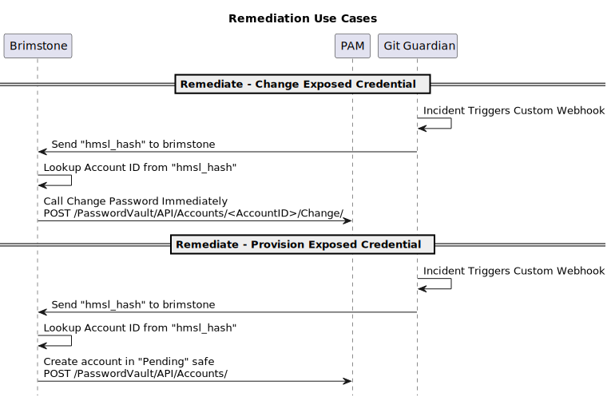
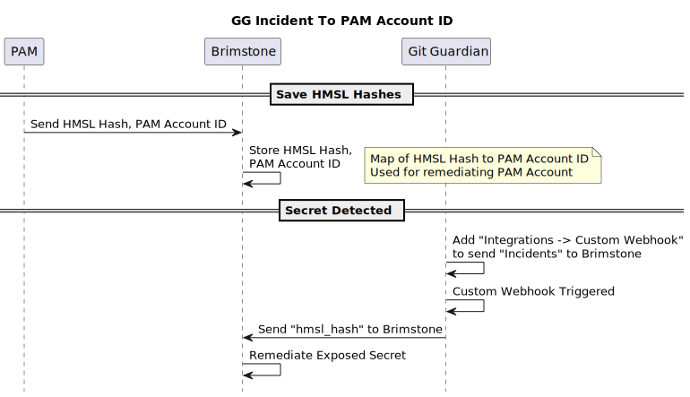

<!-- START doctoc generated TOC please keep comment here to allow auto update -->
<!-- DON'T EDIT THIS SECTION, INSTEAD RE-RUN doctoc TO UPDATE -->

* [Brimstone](#brimstone)
  * [Summary](#summary)
  * [User Stories](#user-stories)
  * [Use Cases](#use-cases)
    * [Use Case - GG Matches Credential In PAM](#use-case---gg-matches-credential-in-pam)
    * [Use Case - GG No Match Credential In PAM](#use-case---gg-no-match-credential-in-pam)
  * [Design](#design)
    * [PAM Endpoints Used For Remediation](#pam-endpoints-used-for-remediation)
    * [Map GG Secret To PAM Vault Account](#map-gg-secret-to-pam-vault-account)
    * [Data Models](#data-models)
      * [ER Diagram](#er-diagram)
      * [Hash Component Definition](#hash-component-definition)
      * [HashBatch Component Definition](#hashbatch-component-definition)
    * [Server Endpoints](#server-endpoints)
  * [Development](#development)
    * [Project Layout](#project-layout)
    * [Running locally](#running-locally)
  * [References](#references)
  * [Colophon](#colophon)
  * [License](#license)
  * [Contributing](#contributing)

<!-- END doctoc generated TOC please keep comment here to allow auto update -->

# Brimstone

<!--
Author:   David Hisel <david.hisel@cyberark.com>
Updated:  <2023-12-28 13:45:25 david.hisel>
-->

## Summary

Facilitate checking the existence of credential(s) found by GitGuardian with credentials(s) in PAM to see if they exist.

To keep credentials opaque, parts of hashes will be used as a proxy when doing comparisons.  E.g. compare the hash of a credential to a similarly hashed password from PAM.

## User Stories

* As a developer, when I commit and push a secret to a git repo that is connected to Gitguardian and that secret is in the PAM vault safe, I expect that secret to be detected, and then the vault notified to change that secret.

* As a developer, when I commit and push a secret to a git repo that is connected to Gitguardian and that secret is not in a PAM vault safe, I expect that the secret to be detected, and then the vault notified to add an account with that secret.

* As a PAM vault administrator, I can generate HMSL hashes for all accounts that I have access to and store them in Brimstone.

* As an authorized Brimstone client, I can trigger Brimstone to send all HMSL hashes to the HasMySecretLeaked service.  Furthermore, I expect the HMSL service responses to be processed whereby any leaked secrets that match an account in the vault will trigger the notification to the vault to change that secret.

## Use Cases

The scope of the use cases is limited to interactions with GG and the PAM Vault.  Other external services fall outside the scope of these use cases.

<!--
```plantuml
@startuml images/remediation-use-cases.svg
title Remediation Use Cases
hide footbox

participant Brimstone as "Brimstone"
participant PAM as "PAM"
participant GG as "Git Guardian"

== Remediate - Change Exposed Credential ==
GG -> GG: Incident Triggers Custom Webhook
GG -> Brimstone: Send "hmsl_hash" to brimstone
Brimstone -> Brimstone: Lookup Account ID from "hmsl_hash"
Brimstone -> PAM: Call Change Password Immediately\nPOST /PasswordVault/API/Accounts/<AccountID>/Change/

== Remediate - Provision Exposed Credential ==
GG -> GG: Incident Triggers Custom Webhook
GG -> Brimstone: Send "hmsl_hash" to brimstone
Brimstone -> Brimstone: Lookup Account ID from "hmsl_hash"
Brimstone -> PAM: Create account in "Pending" safe\nPOST /PasswordVault/API/Accounts/
@enduml
```
-->



### Use Case - GG Matches Credential In PAM

This is the scenario where GG has found a credential and it matches a credential in the PAM.

The action to take would be to rotate the credential inside PAM.

### Use Case - GG No Match Credential In PAM

This is the scenario where GG has found a credential and it does *not* match a credential in the PAM.

The primary action to take would be to provision the credential into the PAM.

Implied Limitations:

* 1 brimstone running per 1 PAM instance

## Design

Provide an endpoint where credential hashes can be posted and persisted.  Also, provide an enpoint where a scheduler can request to upload the hashes to [HasMySecretLeaked.com](https://api.hasmysecretleaked.com/docs).

Requirements:

* send full hash to GG to help dis-ambiguate

Base case:

* Initial load of brimstone will load all creds from PAM using its API
  * Hailstone will be a stand alone appilcation so that it can be run once, and reduce risk to leaking secrets from memory.
  * Hailstone will use PAM API to fetch all account ids visible to the user account, then iterate over accounts to fetch secrets.  The secrets will be hashed, then the hash values are stored for reference and uploading toHMSL
  
* Fetch accounts - [GET /PasswordVault/API/Accounts](https://docs.cyberark.com/PAS/12.6/en/Content/SDK/GetAccounts.htm?tocpath=Developer%7CREST%20APIs%7CAccounts%7C_____1)

* Design Diagram

<!--
```plantuml
@startuml images/brimstone-design.svg
title Brimstone Design
hide footbox

actor Admin as "Admin"
participant Brimstone as "Brimstone"
participant PAM as "PAM"
participant CPM as "CPM Plugin"
participant DB as "CockroachDB"
participant Scheduler as "Scheduler"
participant HMSL as "Has My Secret Leaked"

== Load PAM Accounts to Brimstone using Hailstone Tool ==
Admin -> Brimstone: Run Once
Brimstone -> PAM: <b>GET /PasswordVault/API/Accounts</b>\nGet List of Account IDs

loop For Each Account
  Brimstone -> PAM: <b>GET /PasswordVault/API/Accounts/{accountId}/Password/Retrieve/</b>\nGet Account Password Value
  Brimstone -> Brimstone: Compute Hash For Password
  Brimstone -> DB: Store Hash
end
Brimstone -> Admin: Done

== Updates From CPM Plugin ==
PAM -> Brimstone: <b>PUT /v1/hashes</b>\nCPM Plugin sends hmsl hashes
note right: CPM Plugin computes\nhashes on passwords\nbefore sending
Brimstone -> DB: Store Hashes

== Send To Has My Secret Leaked ==
Scheduler -> Brimstone: <b>GET /v1/hashes/send(prefixes|hashes)</b>\nTrigger Upload to HMSL
Brimstone -> Brimstone: Create Batches
Brimstone -> HMSL: Upload Hashes (or Hash prefixes) to HMSL

@enduml
```
-->


### PAM Endpoints Used For Remediation

* [Change Password Immediately](https://docs.cyberark.com/PrivCloud-SS/latest/en/Content/WebServices/Change-credentials-immediately.htm)
* [Add account](https://docs.cyberark.com/PrivCloud-SS/latest/en/Content/WebServices/Add%20Account%20v10.htm)

### Map GG Secret To PAM Vault Account
<!-- 
```plantuml
@startuml images/gg-to-pam-accountid.svg
title GG Incident To PAM Account ID
hide footbox

participant PAM as "PAM"
participant Brimstone as "Brimstone"
participant GG as "Git Guardian"

== Save HMSL Hashes ==
PAM -> Brimstone: Send HMSL Hash, PAM Account ID
Brimstone -> Brimstone: Store HMSL Hash,\nPAM Account ID
note right: Map of HMSL Hash to PAM Account ID\nUsed for remediating PAM Account

== Secret Detected ==
GG -> GG: Add "Integrations -> Custom Webhook"\nto send "Incidents" to Brimstone
GG -> GG: Custom Webhook Triggered
GG -> Brimstone: Send "hmsl_hash" to Brimstone
Brimstone -> Brimstone: Remediate Exposed Secret
@enduml
```
-->



### Data Models

#### ER Diagram

The database tables are auto-generated by GORM using the data models.  This diagram shows what was generated.
<!-- 
```plantuml
@startuml images/brimstone-er-diagram.svg
skinparam linetype ortho
entity "gorm.Model" as gorm {
  * ID        : uint   `gorm:"primaryKey"`
  CreatedAt : time.Time
  UpdatedAt : time.Time
  DeletedAt : gorm.DeletedAt `gorm:"index"`
}
entity "ModelHash" as hash {
  gorm.Model <<inherited>>
  *name : text
  *hash : text
}
entity "ModelHashBatch" as hashbatch {
  gorm.Model <<inherited>>
  * safename : text
  hashes : List<Hash>
}
entity "SafenameHashes" as safehash {
  * ModelHashBatch.safename : text <<FK>>
  * ModelHash.hash : text <<FK>>
  * ModelHash.name : text <<FK>>
}

hashbatch ||--|{ safehash
safehash ||--|{ hash
@enduml
```
 -->


#### Hash Component Definition

Hash is defined in the [OpenAPI Spec v3](https://spec.openapis.org/oas/v3.0.3) doc in the [api/brimstone.yaml](./api/brimstone.yaml#L135) file.

| Name | Type | Description |
| - | - | - |
| name | string | PAM Account ID |
| hash | string | Hash computed based on account object password value |

Rendered as JSON

```json
{
  "name": "PAM ACCOUNT ID",
  "hash": "HASH STRING",
}
```

#### HashBatch Component Definition

HashBatch is defined in the [OpenAPI Spec v3](https://spec.openapis.org/oas/v3.0.3) doc in the [api/brimstone.yaml](./api/brimstone.yaml#L149) file.

| Name | Type | Description |
| - | - | - |
| safename | string | PAM safe name |
| hashes | List\<Hash\> | List of `Hash` objects |

Rendered as JSON and used for `/v1/hashses` Request body

```json
{
  "safename": "SAFE NAME",
  "hashes": [
    {"name": "PAM ACCOUNT ID 1", "hash": "HASH STRING 1"},
    {"name": "PAM ACCOUNT ID 2", "hash": "HASH STRING 2"},
    {"name": "...",           "hash": "..."},
    {"name": "PAM ACCOUNT ID N", "hash": "HASH STRING N"}
  ]
}
```

### Server Endpoints

* API Key header

  ```text
  Authorization: Bearer [[api key]]
  
  Example:
  Authorization: Bearer abcdef123456
  ```

* **PUT /v1/hashes**
  * Requires:
    * Content-type header, `Content-type: application/json`
    * Authorization Header, `Authorization: Bearer [[api key]]`
  * CPM plugin uses this endpoint to update hashes in brimstone
  * Brimstone to accept payload, add new hashes and rotate hashes to Current-1, Current-2
  * Request body is `HashBatch` structure as serialized JSON
  * Example curl call:

    ```shell
    curl -X PUT \
    -H "Authorization: Bearer abcdef123456" \
    -H "Accept: application/json" \
    -H "Content-Type: application/json" \
    "http://127.0.0.1:9090/v1/hashes" \
    -d '{
      "hashes" : [ {
        "name" : "name1",
        "hash" : "hash1"
      }, {
        "name" : "name2",
        "hash" : "hash2"
      } ],
      "safename" : "safename1"
    }'
    ```

* **GET /v1/hashes/sendprefixes**
  * Requires Authorization Header, `Authorization: Bearer [[api key]]`
  * Trigger brimstone to push current list of hashes as prefixes to HMSL

* **GET /v1/hashes/sendhashes**
  * Requires Authorization Header, `Authorization: Bearer [[api key]]`
  * Trigger brimstone to push current list of full hashes to HMSL

## Development

### Project Layout

```text
$ tree -d --prune --gitignore --noreport --info

├── api
│    { OpenSpec API docs
├── bin
│    { Binary builds
├── cmd
│    { Source for Go main commands
│   ├── brimstone
│   │    { Endpoint Server command
│   ├── ggclient
│   │    { Example client for Gitguardian API
│   ├── hailstone
│   │    { Tool to load Brimstone from PAM
│   ├── hmslclient
│   │    { Example client for HMSL API
│   ├── pamclient
│   │    { Example client for PAM API
│   └── randchar
│        { Utility to generate random characters
├── images
│    { Images for docs (generated images go here too)
├── pkg
│   ├── brimstone
│   │    { Source for Brimstone package (Generated code goes here too)
│   ├── gitguardian
│   │    { Source for gitguardian package (Generated from openapi spec)
│   ├── hasmysecretleaked
│   │    { Source for hasmysecretleaked package (Generated code goes here too)
│   ├── privilegeaccessmanager
│   │    { Source for PAM package
│   └── utils
│        { Source for helpers
├── scripts
│    { Build and Project support scripts
├── sql
│    { SQL to support Brimstone
├── static
│    { Generated html docs
```

### Running locally

* Many tasks have targets rendered in the Makefile, run `make` or `make help` for list of targets
* Install cockroachdb <https://www.cockroachlabs.com/docs/v23.1/install-cockroachdb>
* Start cockroachdb, there's a helper in the Makefile

  ```shell
  make start-cockroach-dev
  ```

* build all binaries

  ```shell
  make build-all-bins
  ```

Make targets are also available to build individual binaries.

* build brimstone

  ```shell
  make build-brimstone
  ```

* build hailstone

  ```shell
  make build-hailstone
  ```

* (Optional) generate API docs

  ```shell
  make gen-brimstone-doc
  open static/brimstone-spec/index.html
  ```

* Run brimstone server locally
  * Assuming that cockroachdb is running locally, then just start brimstone

    ```shell
    # default db: "postgresql://root@localhost:26257/brimstone?sslmode=disable"
    # default listen port: 9191
    ./bin/brimstone 
    ```

  * If cockroachdb is running elsewhere, then provide `-dburl` command line parameter
  * If listening on another port for brimstone, then provide `-port` command line parameter

    ```shell
    # set db url and endpoint listen port
    ./bin/brimstone -dburl "postgresql://user1@example.com:26257/brimstone" -port 11222
    ```

## References

* <https://www.gitguardian.com/hasmysecretleaked>
* <https://blog.gitguardian.com/announcing-has-my-secret-leaked>
* <https://blog.gitguardian.com/hasmysecretleaked-building-a-trustless-and-secure-protocol>
* <https://api.hasmysecretleaked.com/docs>

## Colophon

Brimstone - archaic term for sulfur -> sulfur is the stuff "matches" are made from.  Brimstone, the app, curates the stuff "matches" are made from.  E.g., the hashes are matched with other hashes.

## License

  Copyright (c) 2023 CyberArk Software Ltd. All rights reserved.

  Licensed under the Apache License, Version 2.0 (the "License");
  you may not use this file except in compliance with the License.
  You may obtain a copy of the License at

  <http://www.apache.org/licenses/LICENSE-2.0>

  Unless required by applicable law or agreed to in writing, software
  distributed under the License is distributed on an "AS IS" BASIS,
  WITHOUT WARRANTIES OR CONDITIONS OF ANY KIND, either express or implied.
  See the License for the specific language governing permissions and
  limitations under the License.

For the full license text see [`LICENSE`](LICENSE).

## Contributing

We welcome contributions of all kinds to this repository. For
instructions on how to get started and descriptions of our development
workflows, please see our [contributing
guide](CONTRIBUTING.md).

[Code of Conduct](CODE_OF_CONDUCT.md).
